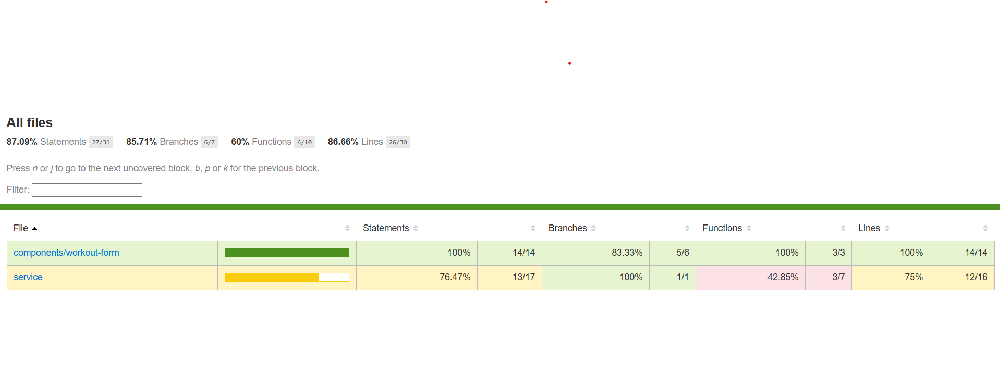

# Health Challenge Tracker - Frontend Development Challenge

## Project Overview

The **Health Challenge Tracker** is a single-page application (SPA) built using **Angular 14+** that allows users to track and manage their workouts. The application allows users to log their name, workout type, and workout minutes, and provides features such as searching, filtering, and pagination.

## Key Features

- **User and Workout Input**:
  - Users can input their name, workout type, and workout minutes.
  - Workout data is saved in **localStorage** to persist user data between sessions.

- **Workout List Display**:
  - Workouts are displayed in a **table format**.
  - Users can see their list of workouts and the total time spent on each type.

- **Search and Filter**:
  - **Search** by username.
  - **Filter** by workout type (e.g., Running, Yoga, Cycling).

- **Pagination**:
  - Displays a **maximum of 5 users per page**. Users can navigate between pages if more than 5 users are added.

## Technologies Used

- **Angular 14+** for building the SPA.
- **Angular Material** for UI components like tables, form fields, and pagination.
- **Tailwind CSS** for styling.
- **localStorage** for persisting user and workout data.

## Data Model

The app stores user data in the following structure:

## Data Structure

The app stores user data in the following structure:

json
userData = [
  {
    "id": 1,
    "name": "John Doe",
    "workouts": [
      { "type": "Running", "minutes": 30 },
      { "type": "Cycling", "minutes": 45 }
    ]
  },
  {
    "id": 2,
    "name": "Jane Smith",
    "workouts": [
      { "type": "Swimming", "minutes": 60 },
      { "type": "Running", "minutes": 20 }
    ]
  }
]

## Setup Instructions 

If you wish to run the project locally, follow these steps:

1. Clone the repository.
2. Run `npm install` to install the dependencies.
3. Run `ng serve` to start the development server.

For a fully functional version, visit the deployed link below.

## Features in Detail

- **Search by Username**: Users can search for other users based on their name.
- **Filter by Workout Type**: Display only specific workout types (e.g., Running, Yoga).
- **Pagination**: Limit the number of users shown on each page (maximum 5 users).

## Unit Testing

Unit tests have been implemented for the key component and service:

- **workout-form component**
- **workout.service**

## code coverage
 The code coverage report can be found below.

